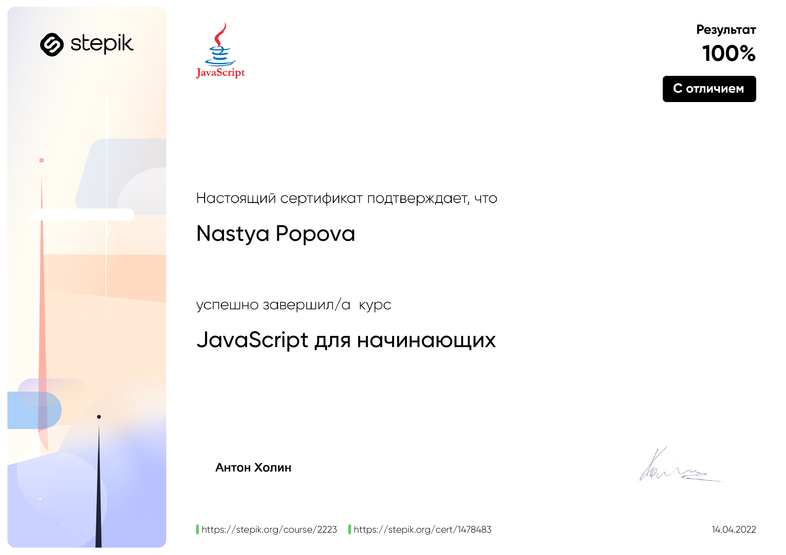
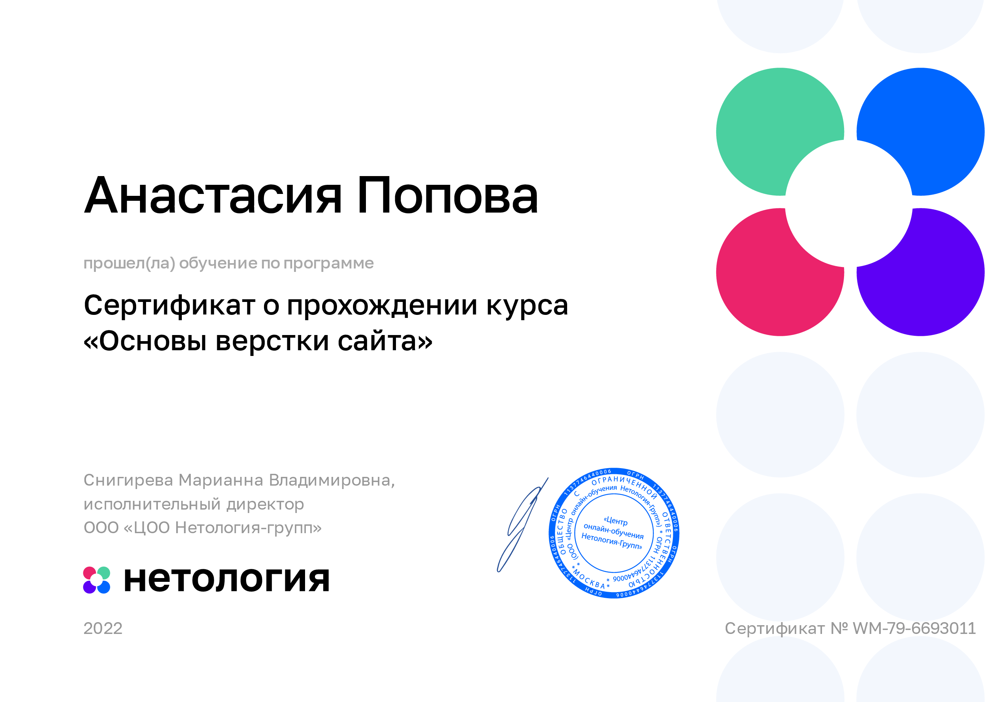

# [rsschool-cv](https://anpopovaa.github.io/rsschool-cv/)
---
# Nastassia Papova
---
## Contact information:
**Phone:** +375 (29) 909-61-91  
**Email:** nastyapopovaa1@gmail.com  
**Telegram:** @anpopovaa  
[Behance](https://www.behance.net/nastassiapapova)

---
## About Me:
My way in IT started as UX/UI designer. I had a lot of self-training and i chose trainee position at a Belarusian IT company and worked there for 6 months.
Now I'm interested in learning from the inside of the product, so i decided to study Front-end.

---
## Skills:
* HTML5, CSS3
* JavaScript Basics
* Git, GitHub
* Figma, Illustrator

---
## Code Example:
**Bit Counting Kata from Codewars:** *Write a function that takes an integer as input, and returns the number of bits that are equal to one in the binary representation of that number. You can guarantee that input is non-negative.*

```
function countBits(num){
  if(num >= 0){
    let sum = 0;
    let num2 = num.toString(2);
    let arr = num2.split('');
    for(let i = 0; i < arr.length; i++){
      sum += parseInt(arr[i]);
    }
    return sum;
  }
}
```

---
## Courses:
* Stepik course (finished)



* Netology course (finished)



* RS School course "JavaScript/Front-end. Stage 0" (in progress)

---
## Languages:
* English B1+
* Russian, Belarussian (Native)